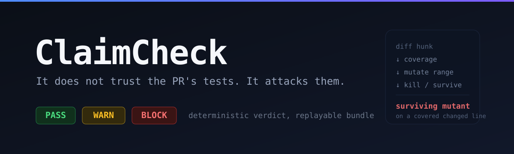

<div align="center">



# ClaimCheck

A deterministic, pre-merge gate that tries to falsify a pull request's own claim about what it changed, using only the PR and the repository.

It does not trust the agent's tests. It attacks them, then returns a replayable verdict: PASS, WARN, or BLOCK.

</div>

[What it proves](#what-it-proves) ·
[How it works](#how-it-works) ·
[Verdict tiers](#verdict-tiers) ·
[The check battery](#the-check-battery) ·
[The oracle layer](#the-oracle-layer) ·
[Determinism](#determinism) ·
[Install](#install) ·
[CLI](#cli) ·
[GitHub Action](#github-action) ·
[Scope](#scope) ·
[Testing tiers](#testing-tiers) ·
[Status](#status) ·
[License](#license)

## What it proves

ClaimCheck proves whether a PR's tests actually constrain the change the PR claims to make. It does not prove the change is semantically correct in the abstract.

A fix that is plausible but subtly wrong, with no failing invariant and no surviving mutant on the changed lines, will pass. Catching that class needs a trusted specification or human judgment, which is a different problem. ClaimCheck owns the part that can be made deterministic and replayable, and it states that boundary openly rather than implying more.

The mechanical cheats it does catch:

- **Claims to fix a bug, the bug is still there.** Caught when the fix-test passes against the unfixed parent, or when the changed lines mutate to a no-op and the test does not notice.
- **Fixes the asked thing, quietly breaks another.** Caught by differential regression: every test that passed on the parent must still pass on head.
- **Hits an error and hides it.** Caught by an error-suppression scan on the changed lines.

## How it works

The run is one deterministic pipeline from a base SHA and a head SHA to a content-addressed verdict bundle.

1. **Worktrees.** Detached parent and head worktrees in isolated scratch dirs.
2. **Diff to ranges.** Parse the unified diff into changed source files, test files, and per-file line ranges.
3. **Nondeterminism scan and flake quarantine.** Identify uncontrollable sources (network, filesystem, timers) and quarantine tests that flip across reruns, so they never affect a verdict.
4. **Coverage intersect.** Run the new tests, collect coverage, and keep only the changed lines those tests exercise.
5. **Targeted mutation.** Pass explicit `--mutate "path:start-end"` ranges to Stryker, scoped to the covered changed lines. Naive `--since` is deliberately avoided: it re-mutates whole files and times out CI.
6. **Battery and oracle.** Run the checks below, then any configured oracle, under one tiering.
7. **Verdict and bundle.** Reduce findings to a tier with a pure decision function and write the replayable bundle.

The IP is the claim-to-probe mapping, not a mutation engine. Mutation testing is Stryker's job; ClaimCheck orchestrates it.

## Verdict tiers

| Tier | Meaning | Exit code |
| --- | --- | --- |
| `PASS` | Every check passed. The tests demonstrably constrain the change and nothing that worked before is broken. | `0` |
| `WARN` | A signal is present but ambiguous, or a check could not run deterministically. Annotates, does not fail. | `0`, or `1` with `--fail-on-warn` |
| `BLOCK` | An unambiguous failure provable from the run alone. | `2` |

BLOCK is reserved for a provable lie: a no-op or condition-inverting mutant surviving on a covered changed line, a covered changed line whose mutants all survive, a regression on a stable test, a weakened existing assertion, a coverage-ignore on a changed line that taint proves no assertion observes, or a test that mocks the changed module while no changed line runs. When in doubt, the verdict is WARN. A false block costs more than a missed cheat, so BLOCK precision is held at 1.0 on the corpus.

## The check battery

Fix mode, v0.1. `assertion-reachability` and `kill-check` are the decisive pair: the same claim-coverage property proven by two independent methods, cross-checked, with disagreement surfaced as WARN rather than resolved silently.

| Check | What it proves |
| --- | --- |
| `test-touches-code` | The new tests execute the changed source lines. |
| `fails-on-parent` | Applying only the test-file diff onto the parent, the new tests fail there, so they are not vacuous. |
| `passes-on-head` | The new tests pass on head, so the claim holds now. |
| `assertion-reachability` | By def-use taint, the changed expression's value flows into an assertion. |
| `kill-check` | Stryker mutates the covered changed lines; a surviving no-op or inversion mutant means the test does not constrain the fix. |
| `regression` | The parent tests the PR did not touch still pass on head. |
| `error-suppression` | No swallowed exceptions or success-on-error-path returns on the changed lines. |
| `test-weakening` | No existing assertion loosened, removed, or skipped to fit the change. |

Two further scans surface the soft cheats that are decidable from the diff alone, as per-line annotations (`--annotations github`):

- **`static-tail`**: coverage-ignore markers (istanbul, c8, v8, node:coverage), type-checker suppression (`@ts-ignore`, `@ts-nocheck`, `@ts-expect-error`), and `any` widening, plus config weakening (lowered coverage thresholds, narrowed CI matrices), dropped `await`, and loosened `toBeCloseTo` tolerance. WARN by default; a coverage-ignore that taint confirms unconstrained escalates to BLOCK.
- **`vacuous-assertion`**: mock-the-SUT, snapshot acceptance over changed output, and tautologies in the new tests. WARN by default; mocking the changed module while no changed line runs escalates to BLOCK.

## The oracle layer

The battery proves the PR's tests constrain the change; it still trusts the agent to have asserted the right thing. The oracle layer narrows that gap by importing a correctness signal from a source that is not the agent, so ClaimCheck can begin to catch a non-vacuous test that asserts the wrong value on the slice where an independent, machine-checkable signal exists. It never infers that signal from the PR; it runs one a human already wrote.

- **issue-repro (shipped).** A bug-fix PR usually links an issue whose body holds a human-written reproduction. The oracle extracts a machine-parseable repro, runs it against head to assert the fixed behavior holds, and against parent to corroborate the bug reproduced there. A fix whose own tests pass but which fails the reporter's repro is a wrong-oracle catch: BLOCK.
- **Registered behind the seam, not yet implemented:** metamorphic-relation, differential-on-unchanged-inputs, and property/contract oracles. Each takes its trusted signal as supplied, never inferred.

The rules match the rest of the tool. The layer is opt-in and additive: with no oracle configured and no oracle input, the evidence record is byte-for-byte unchanged and the bundle hash is identical; a finding can tighten a verdict, never weaken or replace a check. Deterministic or WARN: an oracle that cannot evaluate deterministically returns indeterminate. No freeform-repro guessing: only a fenced code block carrying an executable assertion is run; a repro present but not machine-extractable is WARN, never a fabricated assertion. Fetching a linked issue is networked and lives only in the live tier.

Importing an oracle moves the trust boundary, it does not delete it. Detection completeness is bounded by oracle completeness. A wrong fix that satisfies every imported relation still passes.

## Determinism

The verdict is a pure function of a canonical, content-addressed evidence record. Test executions run inside a sandbox that pins the controllable nondeterminism sources (clock, randomness, high-resolution timer) and denies live network; tests that depend on an uncontrollable source are quarantined with that reason rather than sampled. Identical inputs reproduce an identical record, verdict, and bundle hash. `claimcheck replay` recomputes the verdict from a saved bundle and fails if it does not reproduce.

## Install

ClaimCheck is built from source. It requires Node.js 18.18 or newer.

```bash
git clone git@github.com:moonrunnerkc/claimcheck.git
cd claimcheck
npm ci
npm run build
```

This produces the `claimcheck` binary under `dist/` (`bin: claimcheck`). There is no published npm package or release binary yet; see [Status](#status).

## CLI

```bash
# run against a PR locally (fix mode)
npx claimcheck run --repo <path> --base <parent-sha> --head <head-sha>

# write a replayable bundle
npx claimcheck run --repo <path> --base <sha> --head <sha> --bundle-out ./out

# reuse results for identical inputs
npx claimcheck run --repo <path> --base <sha> --head <sha> --cache-dir ./.cache

# emit per-line annotations for a reviewer's diff
npx claimcheck run --repo <path> --base <sha> --head <sha> --annotations github

# replay a bundle: recompute the verdict from the record alone
npx claimcheck replay ./out/<hash>.bundle.json
```

| Flag | Effect |
| --- | --- |
| `--repo <path>` | Repository to analyze (required). |
| `--base <sha>` | Parent commit the PR forks from (required). |
| `--head <sha>` | Head commit of the PR (required). |
| `--bundle-out <dir>` | Write the verdict bundle to this directory. |
| `--cache-dir <dir>` | Reuse cached bundles for identical inputs. |
| `--json` | Emit the report as JSON. |
| `--annotations <fmt>` | Emit per-line annotations: `github` or `list`. |
| `--fail-on-warn` | Exit nonzero on WARN as well as BLOCK. |

Exit codes: `0` for PASS (and WARN unless `--fail-on-warn`), `2` for BLOCK, `3` for a replay that does not reproduce, `64` for a usage error.

### The verdict bundle

Content-addressed and replayable. It records the parent and head SHAs, the changed line ranges, the mutant manifest with its seed, the def-use chains, the flagged nondeterminism sources, the regressed and quarantined tests, any oracle findings, the per-check results, and the tool version. The oracle-findings field is omitted entirely when no oracle ran, so a run with no oracle hashes identically to one from before the layer existed. The hash is a function of those facts, so re-running the same inputs reproduces it.

## GitHub Action

ClaimCheck ships as a Docker action (`action.yml`, `action/entrypoint.sh`, `Dockerfile`). It runs in a hermetic container, emits per-line annotations onto the PR diff, appends the verdict to the job summary, and fails the check on BLOCK.

```yaml
- uses: actions/checkout@v4
  with:
    fetch-depth: 0
- uses: moonrunnerkc/claimcheck@master
  with:
    base: ${{ github.event.pull_request.base.sha }}
    head: ${{ github.event.pull_request.head.sha }}
    fail-on-warn: "false"
```

Inputs: `base` and `head` (required SHAs), `repo` (default `/github/workspace`), `bundle-out` (default `<workspace>/.claimcheck`), and `fail-on-warn`. Output: `bundle-dir`, the directory the replayable bundle was written to.

## Scope

TypeScript and JavaScript repositories using vitest, fix-mode claims. The language-adapter seam exists so a Python adapter is an addition rather than a rewrite.

Three cheats are permanent non-scope, not a backlog. Each needs an oracle for the intended behavior, and inferring that oracle from the PR alone reintroduces the model-guessing this tool refuses to do:

- **wrong-cap / wrong-constant**: the test asserts a specific expected value, but that value is itself wrong.
- **snapshot of broken output**: a snapshot faithfully records the buggy output; the assertion is real, the captured value's correctness is the open question.
- **exit-0-while-failed**: a harness that reports success regardless of assertions.

ClaimCheck never claims to catch these. The decidable surface near them (a snapshot matcher over changed output) is flagged as WARN, but whether the captured value is correct is never judged. Claim classification, feature-add and refactor modes, and other languages are out of scope for v0.1.

## Testing tiers

- **Hermetic suite** (`npm test`, `npm run eval`): offline and deterministic. It runs against the synthetic corpus and the unit and integration checks, never touches the network, and is where the determinism guarantee and BLOCK precision are measured. `npm run eval` runs the live pipeline detector over the corpus and prints accuracy, BLOCK precision, recall, and determinism.
- **Live tier** (`npm run test:live`): networked and explicitly not part of the determinism guarantee. It clones real external vitest repositories and runs ClaimCheck against historical fix PRs. The default suite excludes it (`*.live.test.ts`, gated by `CLAIMCHECK_LIVE=1`).

## Status

The CLI, the core library, and the Docker GitHub Action are implemented and tested. Build and typecheck are clean, and the hermetic suite passes (221 tests across 34 files). On the 12-case corpus, the live pipeline detector scores 100% accuracy, BLOCK precision 1.0, mechanical recall 100%, and full determinism; the eval harness fails the run if BLOCK precision drops below 1.0.

Not yet shipped: no npm release, no tagged binary, and no `LICENSE` file.

## License

No license is granted yet. `package.json` marks the package `private` and `UNLICENSED`. A license will accompany the first tagged release.
